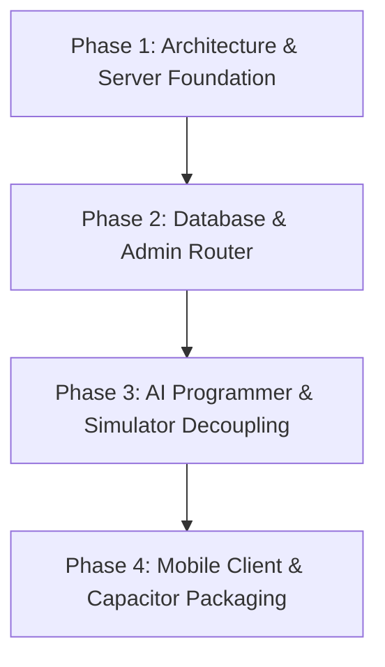

# New Development Plan: BlindEye Platform Architecture & Roadmap

## 1. Overview & Core Philosophy

BlindEye is evolving from a single-page prototype simulator into a modular, server-driven accessibility platform. The goal is to separate the **Programmer Engine (AI configuration builder)**, the **Simulator (web test environment)**, the **Backend (Dynamic Command/State DB)**, and the **Mobile Client**.

---

## 2. Platform Architecture & Separation of Concerns

```
                                  ┌────────────────────────┐
                                  │      Public Landing    │
                                  │     (Product Overview) │
                                  └───────────┬────────────┘
                                              │ Login (Admin Auth)
                                              ▼
                                  ┌────────────────────────┐
                                  │  Admin Portal / Router │
                                  └─────┬────────────┬─────┘
                                        │            │
                   ┌────────────────────┘            └────────────────────┐
                   ▼                                                      ▼
┌──────────────────────────────────────┐                ┌──────────────────────────────────────┐
│       Programmer Engine (AI)         │                │         Simulator Web View           │
│  - Configures contextual commands    │                │  - Simulates device conditions       │
│  - Sets screen/state mapping logic   │◄── Sync via ──►│  - Tests haptics, TTS, gestures      │
│  - Generates state transition graph  │     Database   │  - Evaluates Programmer output       │
└──────────────────┬───────────────────┘                └──────────────────┬───────────────────┘
                   │                                                       │
                   └────────────────────┬──────────────────────────────────┘
                                        ▼
                        ┌──────────────────────────────┐
                        │   Fast API Server & Database │
                        │   (SQLite / PostgreSQL /     │
                        │    SurrealDB Graph Storage)  │
                        └──────────────┬───────────────┘
                                       │ Real-time API / Sync
                                       ▼
                        ┌──────────────────────────────┐
                        │     Mobile Client (APK)      │
                        │    (Capacitor Hybrid Container│
                        │     or Flutter Native Host)  │
                        └──────────────┬───────────────┘
```

### Component Roles:
1. **Public Landing Page:** Overview of BlindEye platform + Secure Admin Login modal/page.
2. **Admin Portal Routes:**
   - `/admin/programmer`: Interactive UI where the AI Programmer configures state machines, maps contextual gestures/commands, and defines usage conditions.
   - `/admin/simulator`: Isolated web view for testing the current configuration under simulated hardware conditions.
3. **Programmer Engine (AI Agent Integration):** Reads scenario prompts/rules, generates contextual action mapping rules, and saves them into the DB.
4. **Simulator Engine:** Consumes live DB configurations and simulates native APIs (Vibration, Web Speech TTS, Gyroscope/Shake) in a web frame.

---

## 3. Database Architecture for Contextual Commands

### Requirements:
- Fast query execution (low latency for gesture resolution).
- Flexible hierarchical structure (contextual/deeper level function mapping: identical gestures like `swipe_right` mean different actions depending on `screen_id`, `focus_state`, or `user_role`).

### Recommended Database: SQLite (with Drizzle ORM / Prisma) or PostgreSQL + JSONB (or Redis Caching)

#### Proposed Schema Design (Graph / Contextual Command Table):

```sql
-- Screens / Views definition
CREATE TABLE screens (
    id TEXT PRIMARY KEY,
    name TEXT NOT NULL,
    parent_screen_id TEXT REFERENCES screens(id)
);

-- Command & Gesture Mapping DB
CREATE TABLE contextual_commands (
    id TEXT PRIMARY KEY,
    screen_id TEXT NOT NULL REFERENCES screens(id),
    gesture_code TEXT NOT NULL, -- e.g., 'SWIPE_RIGHT', 'DOUBLE_TAP', 'SHAKE'
    sub_context TEXT,           -- e.g., 'ITEM_LIST', 'MODAL_OPEN', 'PRIVACY_MODE_ON'
    action_type TEXT NOT NULL,  -- e.g., 'NAVIGATE_NEXT', 'TRIGGER_TTS', 'CALL_CONTACT', 'SOS_DISPATCH'
    action_payload JSONB,       -- e.g., { "target_screen": "messages", "tts_prompt": "Opening Messages" }
    haptic_pattern TEXT,        -- e.g., "SHORT_SHORT", "LONG_SHORT_LONG", "MORSE_SOS"
    created_by TEXT DEFAULT 'AI_PROGRAMMER',
    updated_at TIMESTAMP DEFAULT CURRENT_TIMESTAMP,
    CONSTRAINT unique_contextual_gesture UNIQUE (screen_id, gesture_code, sub_context)
);
```

#### Why this structure?
- Allows **1 gesture to have infinite meanings** based on context (`screen_id` + `sub_context`).
- Simple query execution: `SELECT * FROM contextual_commands WHERE screen_id = ? AND gesture_code = ? AND sub_context = ?`.

---

## 4. Capacitor vs. Flutter Evaluation: OTA Updates & Deployment Strategy

You asked to compare **Flutter** vs. **Capacitor** regarding app updates and real-time server connectivity.

| Feature / Criteria | Capacitor (Hybrid / Web-Packed) | Flutter (Native) |
| :--- | :--- | :--- |
| **App Store / Distribution** | Web bundle inside native Android/iOS wrapper. | Native ARM binary compiled for Android/iOS. |
| **Over-The-Air (OTA) Updates** | **YES (Instant & Real-Time).** Can pull live web bundles or dynamic JSON configs from your server without requiring the user to download a new APK from Play Store. | **NO (Requires Recompile / Reinstall).** Code logic changes require rebuilding APK/AAB and user reinstallation (unless using limited dynamic server-driven UI). |
| **Real-time Server Connection** | **YES.** Connects via WebSocket / SSE to fetch latest gesture mappings and settings live. | **YES.** Can fetch JSON settings, but core app UI/gesture handler updates require app updates. |
| **Sensor & Device Performance** | Excellent for Web Speech TTS, Vibrations, and basic Accelerometer. | Superior native performance for background camera OCR, raw sensor access, and low-latency Bluetooth/Morse hardware. |
| **Development Velocity** | High (Direct reuse of web HTML/CSS/JS codebase). | Medium (Requires Flutter/Dart codebase maintenance). |

### Recommendation: **Capacitor Hybrid Container (Server-Connected PWA/APK)**
- **Why:** Fits your requirement to update gesture rules and settings live without forcing user re-installation.
- The APK will act as a thin native shell hosting the server-driven web view. When the **AI Programmer** updates a gesture mapping in the DB, the mobile APK updates instantly via WebSockets/API.

---

## 5. Web-First / PWA Enhancement Details

To ensure maximum compatibility, rapid iteration, and immediate testability, the web-first architecture incorporates full Progressive Web App (PWA) capabilities and server-side real-time sync.

### 5.1 Architecture & Build Tooling Modernization
- **Modular JS Refactoring:** Split monolithic `app.js` (5,000+ lines) into clean ES modules:
  - `src/core/speech.js` (Web Speech TTS wrapper & Voice UI)
  - `src/core/haptics.js` (Vibration Patterns & Morse Haptic Engine)
  - `src/core/gestures.js` (Swipe/Tap/Shake Detector)
  - `src/core/db.js` (Client cache & WebSocket Sync)
  - `src/modules/*.js` (Messages, Calls, Camera, Navigation, Settings)
- **Vite / Bundler Setup:** Use Vite for instantaneous hot-reloading (HMR), optimized bundling, and TypeScript/ESNext support.

### 5.2 Real AI & Cloud Service Integrations
- **AI Camera OCR & Object Detection:**
  - Replace hardcoded camera mockups with real browser camera feed via `navigator.mediaDevices.getUserMedia()`.
  - Integrate cloud vision APIs (e.g. OpenAI GPT-4o Vision or Google Cloud Vision API) or in-browser Tesseract.js / TensorFlow Lite for offline optical character recognition.
- **GPS & Navigation Engine:**
  - Integrate Web Geolocation API (`navigator.geolocation.watchPosition`) for real-time user positioning.
  - Connect OpenStreetMap / Nominatim / Mapbox APIs for turn-by-turn spoken audio guidance.

### 5.3 PWA & Hardware Interaction Capabilities
- **Service Worker & Manifest (`manifest.json`):** Full offline capability allowing the web application / PWA to function even when network connectivity drops.
- **Hardware API Integration:** Utilize native browser APIs (`Vibration API`, `Web Speech Synthesis/Recognition API`, `DeviceMotionEvent` for shake detection).

---

## 6. Phased Implementation Strategy



### Phase 1: Server & Project Restructuring
- Initialize Node.js/Express (or Next.js) backend with API routes.
- Set up SQLite / PostgreSQL database instance for user settings, command routing, and screen states.

### Phase 2: Landing Page & Admin Routing
- Build public `/` landing page describing BlindEye.
- Implement `/login` authentication module for Admin.
- Build route handlers for `/admin/programmer` and `/admin/simulator`.

### Phase 3: AI Programmer & Decoupled Simulator Engine
- Build the **Programmer API Interface** where the AI agent inputs/modifies screen states, gestures, and haptic signatures in the DB.
- Decouple the web simulator into a standalone web view that consumes configuration dynamically from the DB via WebSocket/REST.

### Phase 4: Capacitor Mobile Packaging & OTA Live Updates
- Integrate `@capacitor/core`, `@capacitor/haptics`, `@capacitor/geolocation`, and `@capacitor/camera`.
- Build live-update mechanism (App fetches latest `contextual_commands` table on startup and syncs changes via WebSockets).

---

## 7. Verification & Next Actions

1. **Review Architecture:** Confirm preference for Capacitor (for instant server updates) vs Flutter.
2. **Database Approval:** Confirm SQLite / PostgreSQL schema proposal for multi-context gesture mapping.
3. **Execution Kick-off:** Prepare workspace directory structure for server and split client components.
